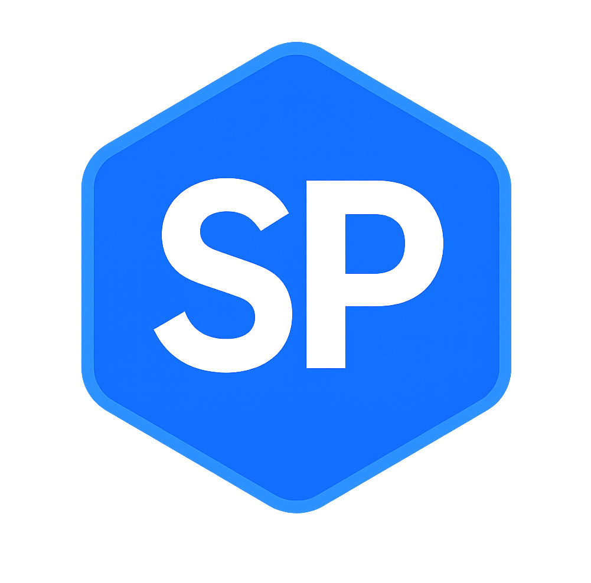

# SoulPeg Documentation



**Official documentation for SoulPeg Labs ecosystem**

This repository contains the official documentation website for SoulPeg Labs, built with Next.js and featuring comprehensive guides, API references, and developer resources.

## 🚀 Features

- **Modern Documentation Site** - Built with Next.js 15 and React 19
- **Markdown Support** - Full MDX support for rich content
- **Search Functionality** - Fast client-side search
- **Responsive Design** - Mobile-optimized documentation
- **Dark/Light Mode** - Theme switching support
- **Interactive Examples** - Live code examples and demos

## 🛠 Tech Stack

- **Framework**: Next.js 15
- **Language**: TypeScript
- **Styling**: Tailwind CSS
- **Content**: MDX (Markdown + JSX)
- **UI Components**: Radix UI
- **Search**: Custom search implementation
- **Typography**: Tailwind Typography

## 📦 Installation

```bash
# Clone the repository
git clone https://github.com/soulpeg-labs/soulpeg-docs.git

# Navigate to project directory
cd soulpeg-docs

# Install dependencies
npm install

# Start development server
npm run dev
```

## 🏗 Project Structure

```
├── app/                 # Next.js App Router
├── components/          # Reusable UI components
├── content/            # Documentation content (MDX files)
├── lib/                # Utility functions
├── public/             # Static assets
├── scripts/            # Build scripts
└── styles/             # Global styles
```

## 📝 Content Structure

```
content/
├── docs/
│   ├── getting-started/
│   ├── guides/
│   ├── api-reference/
│   └── examples/
├── blog/
└── changelog/
```

## ✍️ Contributing to Documentation

We welcome contributions to improve our documentation!

### Adding New Content

1. Create a new MDX file in the appropriate `content/` directory
2. Add frontmatter with title, description, and other metadata
3. Write your content using Markdown and JSX components
4. Update navigation if needed

### Example MDX file:

```mdx
---
title: "Getting Started"
description: "Learn how to get started with SoulPeg"
date: "2024-01-15"
---

# Getting Started

Welcome to SoulPeg! This guide will help you...

## Prerequisites

- Node.js 18+
- A Web3 wallet
- Basic knowledge of DeFi

## Installation

\`\`\`bash
npm install @soulpeg/sdk
\`\`\`
```

### Local Development

```bash
# Start development server
npm run dev

# Build search index
npm run build:search

# Build for production
npm run build
```

## 🚀 Deployment

This documentation site is automatically deployed on Vercel:

- **Production**: [https://docs.soulpeg.io](https://docs.soulpeg.io)
- **Staging**: Auto-deployed from pull requests

## 🤝 Contributing

1. Fork the repository
2. Create your feature branch (`git checkout -b docs/new-guide`)
3. Make your changes
4. Test locally (`npm run dev`)
5. Commit your changes (`git commit -m 'Add new guide'`)
6. Push to the branch (`git push origin docs/new-guide`)
7. Open a Pull Request

## 📋 Content Guidelines

- Use clear, concise language
- Include code examples where applicable
- Add screenshots for UI-related content
- Follow the existing structure and formatting
- Test all code examples before submitting

## 🔗 Links

- **Main Website**: [https://soulpeg.io](https://soulpeg.io)
- **Frontend Repository**: [https://github.com/soulpeg-labs/soulpeg-frontend](https://github.com/soulpeg-labs/soulpeg-frontend)
- **Twitter**: [@soulpeglabs](https://x.com/soulpeglabs)
- **Telegram**: [Join our community](https://t.me/soulpeg)

## 📄 License

This documentation is licensed under the MIT License - see the [LICENSE](LICENSE) file for details.

---

Built with ❤️ by [SoulPeg Labs](https://github.com/soulpeg-labs) 